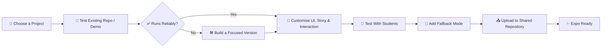

<div align="center">

# 🚀 AI Experience Expo
### *Interactive, Futuristic & Student-Friendly AI Projects*

[](#project-shortlist)
[](#our-vision)
[](#visitor-experience)
[](#technology-toolkit)

> **A curated collection of interactive AI experiences designed to make technology exciting, approachable, and memorable for PU students.**


</div>

---

## Our Vision

<div align="center">

**AI Experience Expo** is designed as an **interactive AI zone** where every visitor can speak, move, solve, create, or play—and see an AI-powered result in a few minutes. This is not just a set of coding projects; it is a way to make AI feel real and exciting for PU students.

> 🎯 **Our objective:** *Students should experience AI, not just watch a demonstration.*

</div>

```text
⚡ Interact  →  🧠 AI processes the input  →  ✨ Visual / voice result  →  🏆 Score, story, or takeaway
```

---

## Visitor Experience

Each project should be a **5–10 minute session** that follows these principles:

| Principle | What it means |
|---|---|
| 🎮 **Easy to start** | Clear instructions; no technical or coding knowledge required |
| ⚡ **Fast feedback** | A visible and satisfying result within the session |
| 🧠 **Real AI value** | Computer vision, voice AI, generative AI, NLP, or intelligent game logic |
| ✨ **Expo-ready UI** | Full-screen visuals, animations, event branding, and large interaction controls |
| 🏆 **Memorable finish** | A score, completion screen, personalised output, or shareable result |
| 🛟 **Reliable operation** | Fallback demos/screenshots if APIs, models, cameras, or internet fail |

---

<div align="center">

## 🌟 Project Shortlist

*10 interactive experiences · 5–10 minutes each · Pure web/software*

</div>

| # | Project | Visitor Interaction | Primary Experience | Status |
|:--:|---|---|---|:--:|
| 01 | [🎙️ JARVIS Voice Assistant](#01-jarvis-voice-assistant) | Speak and ask questions | Futuristic voice AI guide | 🔎 Research |
| 02 | [✍️ AI Air-Writing Maths Solver](#02-ai-air-writing-maths-solver) | Write maths in the air | Vision + AI explanations | 🔎 Research |
| 03 | [📸 AI Future-Self Photo Booth](#03-ai-future-self-photo-booth) | Take/upload a photo | Personalised AI image/poster | 🔎 Research |
| 04 | [🤟 AI Sign-Language Analyser](#04-ai-sign-language-analyser) | Make signs before webcam | Accessibility challenge | 🔎 Research |
| 05 | [💪 AI Fitness Pose Challenge](#05-ai-fitness-pose-challenge) | Perform a pose/exercise | Live posture score | 🔎 Research |
| 06 | [🎹 Air Piano](#06-air-piano) | Play with hand gestures | Gesture-controlled music | 🔎 Research |
| 07 | [🕵️ AI Detective / Escape Room](#07-ai-detective--escape-room) | Solve clues as a team | AI-powered mystery game | 🔎 Research |
| 08 | [🌍 AI Voice-Controlled 3D World](#08-ai-voice-controlled-3d-world) | Give voice commands | Control a visual 3D world | 🔎 Research |
| 09 | [📖 AI Interactive Fiction](#09-ai-interactive-fiction) | Choose actions in a story | Personalised adventure | 🔎 Research |
| 10 | [🔮 AI What-If Simulator](#10-ai-what-if-simulator) | Enter a future scenario | AI-generated future simulation | 🔎 Research |

> **Legend:** 🔎 Research · 🧪 Testing · 🛠️ Customising · ✅ Expo Ready

---

<div align="center">

## 01. 🎙️ JARVIS Voice Assistant

### `NOVA — Your Futuristic AI Guide`

</div>

A cinematic, voice-first assistant that listens to visitors, gives concise spoken answers, hosts rapid tech quizzes, and guides students through future technology topics.

**Why this works**
- 🌌 Creates a strong first impression with a holographic or animated interface
- 🎙️ Combines voice input, LLM reasoning, text-to-speech, and real-time UI updates
- 🛡️ Can be constrained to safe, school-friendly topics: science, AI, technology, careers, and quizzes

**Resources**
- [Voice-first JARVIS (GitHub)](https://github.com/ethanplusai/jarvis)
- [J.A.R.V.I.S. with LangGraph + FastAPI (GitHub)](https://github.com/TimLukaHorstmann/J.A.R.V.I.S.)
- [Iron Man-inspired JARVIS (GitHub)](https://github.com/KKshitiz/J.A.R.V.I.S)
- [Hugging Face text-to-speech models](https://huggingface.co/models?search=tts)

**Customisation plan**
```text
✨ Name: NOVA / AURA / NEXA
🎮 Modes: Science fact -  AI quiz -  Career guide -  Tech challenge
🎨 UI: Dark theme -  Animated orb -  Voice waveform -  Full-screen display
```

---

<div align="center">

## 02. ✍️ AI Air-Writing Maths Solver

### `Write in Air. Solve with AI.`

</div>

Visitors use their index finger to write a maths expression in the air. The system detects the writing and uses AI to produce a clear step-by-step solution.

**Why this works**
- 🎯 Instantly understandable and highly relevant for PU students
- 👁️ Shows a powerful combination of hand tracking, computer vision, OCR/recognition, and generative AI
- 🎮 Can be gamified as a 60-second maths challenge

**Resources**
- [Apple-Inspired AI Calculator: Computer Vision + GenAI (GitHub)](https://github.com/gopiashokan/Apple-Inspired-AI-Calculator-using-Computer-Vision-and-GenAI)
- [GenAI Calculator (GitHub)](https://github.com/Vedant3000/Gen-AI-Calculator)
- [TrOCR models on Hugging Face](https://huggingface.co/models?search=trocr)

**Customisation plan**
```text
🎯 Challenge: Solve 3 PU-level questions in 90 seconds
📤 Output: Recognition preview + step-by-step explanation + score
📚 Themes: Algebra -  Trigonometry -  Physics numericals
```

---

<div align="center">

## 03. 📸 AI Future-Self Photo Booth

### `Meet Your Future Self — 2040 Edition`

</div>

Visitors choose a future identity—scientist, entrepreneur, astronaut, game designer, engineer, explorer, or creator—and receive a stylised AI-generated future poster.

**Why this works**
- 🎨 Personalised outputs encourage participation and sharing
- 🖼️ A visual result is attractive both for the user and people watching the booth
- ⚙️ Can be implemented as image stylisation rather than expensive full face-generation if needed

**Resources**
- [Hugging Face Spaces](https://huggingface.co/spaces) — search `AI photo booth`, `InstantID`, `face portrait`, `image stylisation`, or `future self`
- [Hugging Face image-generation models](https://huggingface.co/models?pipeline_tag=text-to-image)
- [Gradio](https://www.gradio.app/) — fast UI for image-based AI demos

**Customisation plan**
```text
🌌 Themes: Cyberpunk Bengaluru -  Space Explorer -  AI Engineer -  Game Designer
📤 Output: Name + future role + year + QR download page
🔒 Privacy: Ask consent; do not store visitor photos by default
```

---

<div align="center">

## 04. 🤟 AI Sign-Language Analyser

### `SignQuest — Can You Spell Your Name?`

</div>

Visitors learn selected sign-language alphabets, present the gestures to a webcam, and receive live recognition feedback as they spell a word or their name.

**Why this works**
- ♿ An accessible, meaningful use of AI that is naturally gamified
- 📚 Visitors learn something while competing for a score
- 🖐️ Displays live hand landmarks and recognition output clearly

**Resources**
- [Sign Language Detection Web Application (GitHub)](https://github.com/edlabadkarsameer/Sign-Language-detection-Web-Application-)
- [Real-time Sign Language Recognition (GitHub)](https://github.com/iremirezdeganuza72/sign_language)
- [Sign-language models on Hugging Face](https://huggingface.co/models?search=sign+language)

**Customisation plan**
```text
🎯 Challenge: Spell your name / complete a secret word
🏆 Scoring: Accuracy + speed + streak bonus
📺 Display: Live hand skeleton + detected alphabet + progress bar
```

---

<div align="center">

## 05. 💪 AI Fitness Pose Challenge

### `Pose Perfect — Beat the AI Score`

</div>

Visitors perform a squat, yoga pose, plank, or exercise sequence while the system tracks posture, counts repetitions, and awards a score.

**Why this works**
- 🔥 Encourages energetic participation and attracts spectators
- 📐 Live body landmarks, angle measurements, and score animations look technically advanced
- 🎯 Easy to understand without technical explanation

**Resources**
- [AI Fitness Trainer with YOLOv8-Pose (GitHub)](https://github.com/KKopilka/AI-FinessTrainer)
- [Fitness AI Trainer: Recognition + Counting (GitHub)](https://github.com/RiccardoRiccio/Fitness-AI-Trainer-With-Automatic-Exercise-Recognition-and-Counting)
- [Exercise Recognition AI (GitHub)](https://github.com/chrisprasanna/Exercise_Recognition_AI)
- [Pose-estimation models on Hugging Face](https://huggingface.co/models?search=pose+estimation)

**Customisation plan**
```text
🎯 Challenge: 30-second squat challenge / match-the-pose challenge
📤 Output: Form score + repetition count + leaderboard
⚠️ Note: Clearly present as a fun activity, not medical advice
```

---

<div align="center">

## 06. 🎹 Air Piano

### `Play Music in Mid-Air`

</div>

Visitors play virtual piano keys without touching anything. Hand tracking detects finger positions and triggers notes in real time.

**Why this works**
- 🎵 Simple to understand, visually impressive, and genuinely fun
- 👥 Suitable for visitors of any background and works well as a short queue-based activity
- ⚡ The output is immediate: move hands → make music

**Resources**
- [Pyano: Virtual Piano in Air (GitHub)](https://github.com/jaykhatri0875/pyano)
- [MediaPipe Hands documentation](https://ai.google.dev/edge/mediapipe/solutions/vision/hand_landmarker)

**Customisation plan**
```text
🎮 Modes: Free play -  Play the tune -  Rhythm challenge
🎯 Game idea: Hit highlighted keys before time runs out
📤 Output: Accuracy score + combo streak + applause animation
```

---

<div align="center">

## 07. 🕵️ AI Detective / Escape Room

### `Case Zero — Solve the Mystery in 7 Minutes`

</div>

A team investigates a fictional case through digital clues, AI witness interrogation, puzzle-solving, and a final accusation before the timer expires.

**Why this works**
- 👥 Designed for 2–5 visitors and a complete 5–10 minute experience
- 🧩 Combines storytelling, logical reasoning, AI conversations, and gamification
- 🏫 The mystery can be localised with a campus, science-lab, space-station, or cybercrime theme

**Resources**
- [EscAIpe Room: Bank Breakout (GitHub)](https://github.com/shyke0611/EscAIpe-Room-Game-Bank-Breakout)
- [AI Escape Room (GitHub)](https://github.com/SirBillyBobJoe/AI-Escape-Room)
- [Prompt Escape (GitHub)](https://github.com/billwhalenmsft/PromptEscape)
- [Escape Room topic on GitHub](https://github.com/topics/escape-room)

**Customisation plan**
```text
📖 Story: The missing invention / hacked college server / stolen lab prototype
🔄 Flow: Briefing → 3 clues → AI witness → final answer → result screen
📤 Output: Time taken + hint count + detective rank
```

---

<div align="center">

## 08. 🌍 AI Voice-Controlled 3D World

### `Command the Future`

</div>

Visitors speak commands such as "create a planet," "make it rain," "launch a rocket," or "open a portal," and a browser-based 3D world changes in response.

**Why this works**
- 🚀 Delivers a sci-fi experience using only a browser, microphone, and display
- 🌌 Makes voice AI visible through dramatic 3D animation rather than plain text responses
- 🎛️ Can use a curated command set for reliable public demonstrations

**Resources**
- [Three.js](https://threejs.org/)
- [A-Frame WebXR framework](https://aframe.io/)
- [MDN Web Speech API](https://developer.mozilla.org/en-US/docs/Web/API/Web_Speech_API)
- [Hugging Face Spaces](https://huggingface.co/spaces) — search `3D`, `WebXR`, or `interactive scene`

**Customisation plan**
```text
🌌 Worlds: Space lab -  Smart city -  Underwater base -  Cyberpunk Bengaluru
🎤 Commands: Launch rocket -  Change weather -  Spawn planet -  Open portal
📤 Output: Command streak + explorer score + animated achievement badge
```

---

<div align="center">

## 09. 📖 AI Interactive Fiction

### `Choose Your Adventure — Finish in 8 Minutes`

</div>

A visitor chooses a genre and then makes decisions in a dynamic AI-generated story. Their choices determine the clues, twists, allies, and ending.

**Why this works**
- 💻 Works entirely in the browser and requires no camera, microphone, or special hardware
- 🎲 Every session can produce a different story and ending
- 🎭 Easy to adapt into sci-fi, mystery, fantasy, cybercrime, or college-life themes

**Resources**
- [Infinite IF (GitHub)](https://github.com/nothans/if)
- [Interactive Story Generator: Gradio + Llama (GitHub)](https://github.com/ChanMeng666/interactive-story-generator)
- [AI Story Generator with TTS (GitHub)](https://github.com/MuhammadAli7896/AI-Story-Generator)
- [Interactive Story Creator (GitHub)](https://github.com/maelys-mcardle/interactive-story-creator)
- [Choose Your Own Adventure topic](https://github.com/topics/choose-your-own-adventure)

**Customisation plan**
```text
🎭 Genres: Sci-fi -  Mystery -  Fantasy -  Cybercrime
🔄 Flow: Pick genre → 4 decision rounds → ending → explorer profile
📤 Output: Ending card + choices summary + replay prompt
```

---

<div align="center">

## 10. 🔮 AI What-If Simulator

### `FutureLens — What If?`

</div>

Visitors enter a scenario such as "What if Bengaluru had no traffic?", "What if schools used AI tutors?", or "What if we lived on Mars?" The system produces a short, interactive future scenario with opportunities, risks, and outcomes.

**Why this works**
- 🔭 Makes large future questions understandable through a personalised interactive simulation
- 🧠 Combines generative AI, scenario modelling, visual cards, and decision-making
- 🎲 Can include multiple endings based on visitor choices

**Resources**
- [Story Forge: LLM-powered story writer (GitHub)](https://github.com/SartajBhuvaji/Story-Forge)
- [Interactive Story Game (GitHub)](https://github.com/minki-j/interactive_story_game)
- [Hugging Face Spaces](https://huggingface.co/spaces) — search `future`, `scenario`, or `simulation`

**Customisation plan**
```text
🌆 Scenarios: Smart city -  Climate future -  Space colony -  AI classroom
🔄 Flow: Enter scenario → choose 3 decisions → view consequences → result card
📤 Output: Future score + impact map + "Your 2040 vision" summary
```

---

<div align="center">

## 🛠️ Technology Toolkit

*Tools and platforms we'll use to build these experiences*

</div>

| Need | Suggested Tools | Resource |
|---|---|---|
| 🌐 Web application | React, Next.js, Vite, FastAPI | [React](https://react.dev/) · [FastAPI](https://fastapi.tiangolo.com/) |
| 🤖 AI demo interface | Gradio, Streamlit | [Gradio](https://www.gradio.app/) · [Streamlit](https://streamlit.io/) |
| 🧠 AI models & public demos | Hugging Face Models and Spaces | [Hugging Face](https://huggingface.co/) · [Spaces](https://huggingface.co/spaces) |
| 🎙️ Voice interaction | Web Speech API, Whisper, TTS | [Web Speech API](https://developer.mozilla.org/en-US/docs/Web/API/Web_Speech_API) |
| 👁️ Vision interaction | MediaPipe, OpenCV, YOLO | [MediaPipe](https://ai.google.dev/edge/mediapipe) |
| ✨ Generative AI | Gemini API, Llama, image models | [Google AI Studio](https://aistudio.google.com/) |
| 🌍 3D experiences | Three.js, A-Frame | [Three.js](https://threejs.org/) · [A-Frame](https://aframe.io/) |
| 🚀 Hosting / demos | Hugging Face Spaces, Vercel, Streamlit Community Cloud | [HF Spaces](https://huggingface.co/spaces) · [Vercel](https://vercel.com/) |

---

<div align="center">

## 🔄 Team Workflow

*From idea to expo-ready experience*

</div>



### Suggested Responsibilities

| Role | Responsibility |
|---|---|
| 👤 Project owner | Tests the base project, understands its code, and owns delivery |
| 🎨 UI/UX member | Creates the visual theme, instructions, animations, and result screen |
| ⚙️ AI/backend member | Handles model/API integration, prompts, data flow, and reliability |
| 🎮 Game/content member | Designs questions, stories, puzzles, scoring, and safe visitor flows |
| 🧪 QA/demo member | Tests visitor flow, prepares fallback assets, and documents setup |

---

<div align="center">

## 📁 Repository Structure

*Organised for collaboration and scalability*

</div>

```text
ai-experience-expo/
│
├── 01-nova-voice-assistant/
├── 02-air-writing-maths-solver/
├── 03-future-self-photo-booth/
├── 04-signquest-analyser/
├── 05-pose-perfect-challenge/
├── 06-air-piano/
├── 07-case-zero-escape-room/
├── 08-voice-controlled-3d-world/
├── 09-interactive-fiction/
├── 10-futurelens-what-if-simulator/
│
├── shared-assets/
│   ├── branding/
│   ├── posters/
│   ├── demo-videos/
│   └── fallback-screens/
│
├── docs/
│   ├── setup-guide.md
│   ├── expo-runbook.md
│   └── project-status.md
│
└── README.md
```

---

<div align="center">

## ✅ Project Selection Checklist

*Before finalising a project, confirm these points*

</div>

- [ ] 🎯 A first-time visitor understands it in under 10 seconds
- [ ] ⏱️ The interaction can finish in 5–10 minutes
- [ ] 👀 The result is visible and enjoyable for spectators too
- [ ] 💻 The code runs on available laptops or hosting resources
- [ ] 🔑 API keys, GPU needs, model downloads, and internet dependency are known
- [ ] 🎨 The UI and content can be customised for the event
- [ ] 📷 Camera/microphone/photo consent is clear where applicable
- [ ] 🔒 No visitor data is retained without explicit permission
- [ ] 🛟 A fallback demo mode exists if the live system fails
- [ ] 📝 Setup steps are documented in that project folder

---

<div align="center">

## 🚀 Recommended First Steps

1. **Create** the shared GitHub organisation/repository and add the folder structure above
2. **Assign** one project owner and at least one reviewer to each project
3. **Clone or fork** the base repositories into an individual testing branch
4. **Record** setup issues: dependencies, model size, API keys, GPU/CPU needs, and run time
5. **Choose** the projects that are both impressive **and reliable** for the final expo lineup
6. **Standardise** branding, onboarding instructions, result screens, and fallback demos across projects

---

</div>

<div align="center">

### ✨ Build experiences. Spark curiosity. Make AI memorable.

**AI Experience Expo** · *Interactive projects for the next generation of creators*

*Curated by **Tech Nexus(Technical Club)***

</div>
